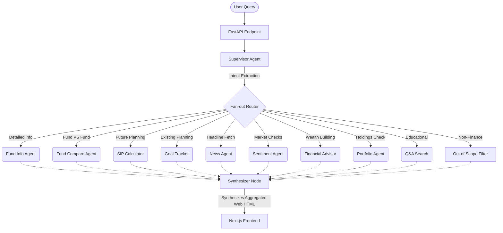

# Mutual Fund Analyzer

Mutual Fund Analyzer is an AI-powered, stateless, single-turn financial assistant built specifically for the Indian market. It leverages multi-agent architecture and parallel processing to answer complex financial queries, compare funds, analyze mutual fund portfolios, calculate SIP plans, and understand market sentiments in real-time.

---

## 🎯 The Problem & Our Solution Approach

**The Problem:** Traditional mutual fund applications behave like static databases—offering facts but no actionable insights. On the other hand, traditional conversational LLMs hallucinate stock data and struggle to analyze complex, multi-part financial goals consistently.

**The Solution Approach:**
To solve this, we built a **stateless, graph-linked multi-agent system**.

1. **Intelligent Routing:** A "Supervisor" node understands the user's intent(s)—even if they ask for three different things at once—and extracts relevant entities (fund names, tenure, monthly budget).
2. **Parallel Processing:** Instead of a generic LLM thinking contextually, specialized tools (e.g. `sip_calculator`, `fund_compare`) trigger simultaneously to parse exact math or fetch real-time data using search tools.
3. **Structured Synthesis:** A "Synthesizer" gathers all raw analytical outputs, enforces financial disclaimers, and styles a clean HTML response rendered seamlessly on the user's screen.
4. **Scope Control:** Non-financial queries are actively intercepted and politely rejected to maintain a premium advisory character.

### High-Level Architecture Flow



---

## 🚀 Features

- **Fund Comparison:** Pit two or more mutual funds against each other to receive a definitive verdict.
- **SIP Planning & Tracking:** Enter a target corpus or an existing SIP amount; the AI will back-test and forecast feasibility.
- **Market Sentiment & News:** Gets instantaneous updates on Nifty/Sensex movements and summarizes the bullish/bearish market sentiment.
- **Portfolio Reviewer:** Feed your holdings. The analyzer reviews sector diversifications and generic asset allocation principles.
- **Holistic Financial Advice:** Recommends standard best practices (e.g., 50/30/20 budget rule).
- **Export Reports:** Beautiful built-in single-click PDF exporting on the frontend to save analyses offline.

---

## 🛠 Tech Stack

**Backend:**

- **Language:** Python
- **API Framework:** FastAPI
- **Workflow & Agent Engine:** LangGraph & LangChain
- **LLM:** OpenAI (`gpt-4o`)
- **Data Integrations:** Tavily Search Engine

**Frontend:**

- **Framework:** Next.js (React)
- **Styling:** Custom Premium Vanilla CSS (Minimalist styling, dark-mode aesthetic)
- **PDF Generation:** html2pdf.js

---

## 💻 Local Setup & Installation

Follow these steps to run the project locally.

### 1. Requirements

Ensure you have the following installed:

- [Node.js](https://nodejs.org/en/)
- [Python 3.10+](https://www.python.org/)
- An [OpenAI API Key](https://platform.openai.com)
- A [Tavily API Key](https://tavily.com/)

### 2. Backend Setup

The backend runs the LangGraph AI models and exposes the `/chat` endpoint.

```bash
# 1. Navigate to the backend directory
cd backend

# 2. Create and activate a Virtual Environment
python3 -m venv myenv
source myenv/bin/activate  # On Windows use: myenv\Scripts\activate

# 3. Install dependencies
pip install -r requirements.txt

# 4. Setup your Environment Variables
# Create a .env file containing:
# OPENAI_API_KEY=your_openai_key
# TAVILY_API_KEY=your_tavily_key

# 5. Start the backend server
uvicorn main:app --reload --port 8000
```

_The backend should now be actively listening on `http://localhost:8000`_

### 3. Frontend Setup

The frontend hosts the sleek React user interface.

```bash
# 1. Navigate to the frontend directory
cd frontend

# 2. Install Javascript dependencies
npm install

# 3. Setup your Environment Variables
# Create a .env.local file containing:
# NEXT_PUBLIC_BACKEND_URL=http://localhost:8000

# 4. Run the development server
npm run dev
```

### 4. Try it out!

Go to [http://localhost:3000](http://localhost:3000) in your browser.
Try typing: _"Compare Axis Bluechip with HDFC Top 100, and also create a SIP plan for reaching 1 Crore in 10 years."_
